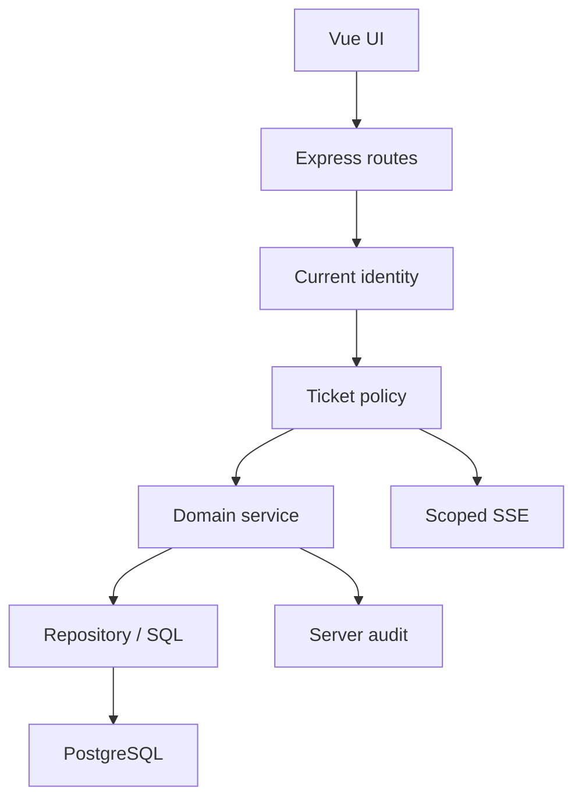

# Hardening Continuation Plan

## Re-audit branch `hardening/phase0-p0-slice-1`

> Repository: `muhhlmy/it-monitoring-assets`  
> Base: `main@aca4f33f6b1da9c9da18a0ab9cc2a0f4177a3c2e`  
> Branch head: `1662005e1c2b46b419979fdbace493ace108d520`  
> Selisih terhadap `main`: 3 commit di depan, 0 commit di belakang, 29 file berubah  
> Tanggal pemeriksaan: 30 Juli 2026  
> Stack: Vue 3, Express 5, PostgreSQL, JavaScript, ES Modules

## 1. Verdict

### Kesiapan merge

**CONDITIONAL PASS untuk perubahan security Slice 1 dan Slice 2.**

Implementasi secret, full-database export containment, export kustom, dan audit
integrity sudah bergerak benar dan layak dipertahankan. Sebelum merge, rapikan
status dokumentasi dan hadirkan bukti check otomatis atau hasil verifikasi yang
dapat direproduksi.

### Kesiapan production

**BLOCKED.**

Branch belum boleh dianggap production-ready karena masih memiliki P0 berikut:

1. ticket resource authorization belum konsisten;
2. actor komentar masih dapat dipalsukan client;
3. password masih plaintext;
4. DDL, seed, dan backfill masih berjalan dari request path;
5. fresh schema masih rusak;
6. backup/restore rehearsal belum tersedia;
7. commit head tidak memiliki status check atau PR workflow run yang terdeteksi.

Pekerjaan berikutnya tidak boleh mengulang Slice 2. Fokus paling aman adalah
**P0 Slice 3 — Ticket Authorization & Actor Integrity** tanpa migration
database.

## 2. Apa yang Berubah Sejak Audit Sebelumnya

Audit sebelumnya memeriksa head:

`603b6f22507a984b46150bf3b7a362858c83b236`

Branch sekarang memiliki dua commit tambahan dan head:

`1662005e1c2b46b419979fdbace493ace108d520`

Perubahan baru mencakup:

- export kustom dibatasi ke superadmin;
- limit export diwajibkan sebagai integer `1..1000`;
- identifier export memakai allowlist;
- response export diproyeksikan ulang untuk mencegah field tak terduga bocor;
- metadata ticket export diselaraskan dengan kolom PostgreSQL aktif;
- formula spreadsheet dinetralkan dan HTML export di-escape;
- fake audit request dari `App.vue` dihapus;
- `POST /api/logs/audit` dihapus;
- pembacaan audit login dibatasi ke superadmin;
- login audit memakai actor canonical dari database atau penanda server;
- test backend dan frontend untuk export/audit ditambahkan;
- `Prompt.md` justru sudah tidak ada pada head;
- `Plan.md` belum diperbarui setelah Slice 2 selesai;
- baseline masih menyebut Slice 2 sebagai working tree yang belum di-commit,
  padahal perubahan tersebut sekarang sudah menjadi commit.

## 3. Metode dan Batas Pemeriksaan

Pemeriksaan read-only meliputi:

- verifikasi branch dan perbandingan terhadap `main`;
- perbandingan terhadap head audit sebelumnya;
- inspeksi 29 file yang berubah;
- inspeksi auth, export, audit, ticket, queue, SSE, permission, session,
  attachment, schema, seed, dan test;
- targeted scan 34 file utama, sekitar 9.678 baris;
- inspeksi status check dan workflow pada head;
- peninjauan ulang `Plan.md` dan `docs/hardening-baseline.md`.

Tidak dilakukan:

- perubahan branch GitHub;
- clone dan eksekusi source secara lokal;
- koneksi ke database;
- migration, seed, backfill, atau query tulis;
- rotasi secret;
- deployment;
- reproduksi hasil test yang ditulis dalam baseline.

Karena tidak ada status check atau workflow run yang terdeteksi, angka test
berikut diperlakukan sebagai **hasil yang dicatat oleh branch**, bukan bukti CI:

- backend `27/27`;
- frontend `6/6`;
- frontend build lulus dengan warning chunk besar;
- lint/format masih gagal pada debt baseline.

## 4. Status Hardening

| Area | Status terbaru | Penilaian |
| --- | --- | --- |
| Fallback `DB_PASSWORD` | Selesai | Dihapus dan fail-fast |
| Fallback `JWT_SECRET` | Selesai | Dihapus; sign/verify memakai satu konfigurasi |
| Full-database export | Selesai | Route dan UI dihapus; regression test `404` |
| Export role boundary | Selesai sebagai containment | Superadmin-only di backend |
| Export row limit | Selesai | Integer wajib `1..1000` |
| Export allowlist/redaction | Selesai untuk kontrak saat ini | Field tak terduga diproyeksikan keluar |
| Ticket export metadata | Selesai | Nama kolom aktif sudah dipakai |
| Central export injection defense | Selesai untuk utility tersebut | CSV/Excel formula dan HTML/PDF dynamic content diuji |
| Client-writable login audit | Selesai | Endpoint POST dan side effect frontend dihapus |
| Audit read boundary | Selesai sebagai containment | Superadmin-only |
| Login audit actor | Selesai untuk alur login | Actor database/server, bukan body |
| Dokumentasi snapshot | Belum selesai | `Plan.md` dan baseline stale |
| `Prompt.md` | Hilang | Tidak ada pada head |
| Ticket authorization | P0 terbuka | IDOR dan cross-queue masih mungkin |
| Comment actor | P0 terbuka | Body masih mengalahkan `req.user` |
| Password hashing | P0 terbuka | Login/create/update/seed plaintext |
| Migration system | P0 terbuka | Runtime DDL/backfill masih aktif |
| Recovery proof | P0 terbuka | Belum ada restore rehearsal |
| CI | Belum terbukti | Tidak ada check/workflow run pada head |
| Session transport | P1 terbuka | `localStorage` dan query-token SSE |
| Attachment pipeline | P1 terbuka | Base64 dan kolom `TEXT` |

## 5. Review Implementasi Slice 2

### 5.1 Export containment

Yang sudah benar:

- `exportRoutes.js` memakai `authorizeRoles('superadmin')`;
- alias `super admin` tetap diterima oleh middleware;
- unauthenticated, user, dan admin ditolak sebelum query database pada test;
- `tableName` dan column identifier berasal dari allowlist;
- duplicate, unknown, dan empty column selection ditolak;
- limit harus number integer dan tidak boleh melewati 1.000;
- date dan text filter memiliki validasi;
- query value tetap parameterized;
- metadata ticket tidak lagi memakai nama field lama;
- response row diproyeksikan hanya ke selected columns;
- `password`, `permissions`, token, dan field mock tak terduga tidak bocor;
- unexpected server error tidak mengirim detail database ke client.

Follow-up, bukan blocker Slice 2:

- metadata count menjalankan query secara serial untuk seluruh tabel;
- error count setiap tabel diubah menjadi `0`, sehingga masalah schema dan
  masalah koneksi terlihat sama;
- pencarian `%term%` lintas banyak kolom dapat memindai tabel besar;
- belum ada statement timeout, export job, atau audit event export;
- test masih memakai mock pool, belum database integration terisolasi.

### 5.2 Audit integrity

Yang sudah benar:

- `App.vue` tidak lagi mengirim audit palsu saat mount;
- `POST /api/logs/audit` sekarang `404`;
- audit login hanya dapat dibaca superadmin;
- actor login sukses/gagal untuk akun dikenal berasal dari row database;
- akun tidak dikenal memakai penanda server;
- IP dan user-agent tidak diambil dari body;
- password dan token tidak dimasukkan ke audit response.

Follow-up:

- keputusan retensi dan redaction audit belum ada;
- konfigurasi trusted proxy belum terdokumentasi, sehingga makna `req.ip`
  berbeda antar deployment;
- inactive-user failure belum memiliki kebijakan audit eksplisit;
- logout saat ini hanya menghapus local state dan tidak menghasilkan
  server-side session invalidation karena sistem masih memakai bearer JWT.

### 5.3 Frontend export security

Yang sudah benar:

- route dan menu export superadmin-only untuk UX;
- UI selalu mengirim numeric limit;
- central export engine meng-escape dynamic HTML;
- formula prefix CSV/Excel dinetralkan;
- output dibatasi maksimal 1.000 row dari server.

Follow-up:

- `document.write` masih digunakan, walaupun dynamic data pada utility ini sudah
  di-escape;
- utility print/export lain belum seluruhnya melalui helper aman yang sama;
- route view utama masih eager-loaded;
- `ExportView.vue` masih sekitar 902 baris.

## 6. Temuan P0 Terbuka

### P0-01 — Ticket IDOR dan cross-queue authorization

#### Bukti

- `getTicketHistory` dan `getTicketComments` hanya memberi ownership check jika
  role persis bernilai `user`.
- Admin non-super tidak diperiksa terhadap `user_ticket_queues` pada history
  dan comments.
- Role lain seperti `teknisi` tidak masuk check `role === 'user'`, sehingga
  dapat lolos ke data ticket mana pun berdasarkan ID.
- `createTicketComment` hanya mengecek ID dan status ticket; tidak mengecek
  ownership, queue, atau assignment.
- `updateTicket` dan `deleteTicket` memakai `requireAdmin`, tetapi tidak
  memastikan admin mempunyai akses ke queue/assignment ticket.
- `getTicketCasp` mengambil ticket dan rating sebelum memastikan caller boleh
  membaca resource; response masih dapat mengandung feedback dan snapshot
  actor walaupun `eligible` bernilai false.
- CASP stats/trend untuk admin non-super tidak difilter ke queue admin.
- `listQueueAdmins` dapat dipanggil setiap user terautentikasi dan mengembalikan
  nama serta email admin.

#### Dampak

Caller terautentikasi dapat membaca, mengomentari, mengubah, menghapus, atau
menerima metadata ticket di luar scope bisnisnya.

#### Target

Buat satu policy service untuk:

- `canReadTicket`;
- `canCommentTicket`;
- `canManageTicket`;
- `canDeleteTicket`;
- `canRateTicket`;
- `scopeTicketQuery`;
- `scopeTicketEvent`.

Policy minimum:

| Actor | Read/history/comments | Comment | Update/resolve | Delete | CASP submit |
| --- | --- | --- | --- | --- | --- |
| Reporter | Ticket milik sendiri | Ticket sendiri dan terbuka | Tidak | Tidak | Ticket sendiri setelah resolved |
| Admin queue | Queue sendiri/assigned | Queue sendiri/assigned dan terbuka | Queue sendiri/assigned | Tidak secara default | Tidak |
| Superadmin | Semua | Ticket terbuka | Semua | Ya | Hanya jika juga reporter |
| Role tak dikenal | Tolak | Tolak | Tolak | Tolak | Tolak |

Authorization tidak boleh hanya membandingkan display name. Untuk ticket legacy
dengan `pelapor_user_id IS NULL`, default aman adalah deny kepada user sampai
ada backfill yang diverifikasi. Jangan menjalankan backfill sebelum recovery
gate.

### P0-02 — Actor komentar dapat dipalsukan

#### Bukti

Backend:

```js
const { pesan, attachment, nama_pengguna, role_pengguna } = req.body
const userNama = nama_pengguna || req.user?.nama || 'User'
const userRole = role_pengguna || req.user?.role || 'user'
```

Frontend juga masih mengirim `nama_pengguna` dan `role_pengguna`.

#### Target

- body comment hanya menerima content dan attachment yang tervalidasi;
- nama, role, dan user ID berasal dari authenticated server context;
- unknown/missing actor ditolak, bukan diganti silent menjadi `User`;
- spoof field ditolak atau diabaikan secara eksplisit;
- actor audit/log ticket ditulis dalam transaction yang sama.

### P0-03 — SSE membocorkan event lintas queue

#### Bukti

`realtimeService.js` mengirim seluruh event ke semua admin dan superadmin:

```js
if (!regularUser) return true
```

Akibatnya admin queue A dapat menerima payload ticket atau comment queue B.
Payload event dapat memuat row ticket lengkap dan attachment.

Selain itu, fallback tanpa `clientUser` mengembalikan `true`; prinsip aman
seharusnya fail closed.

#### Target

- event delivery memakai policy yang sama dengan HTTP;
- reporter hanya menerima ticket miliknya;
- admin hanya menerima queue/assignment yang diizinkan;
- superadmin menerima semua;
- missing/unknown identity ditolak;
- payload event memakai DTO minimum, bukan row database lengkap;
- test membuktikan event queue A tidak diterima admin queue B.

### P0-04 — Password plaintext

#### Bukti

- login membandingkan `password === user.password`;
- create/update user menyimpan `String(password)` langsung;
- `Seed.sql` berisi password literal;
- baseline mencatat seluruh 4 akun existing masih non-bcrypt;
- dependency `bcryptjs` sebenarnya sudah tersedia.

#### Target

1. backup/restore rehearsal;
2. hash untuk create dan update;
3. migration akun existing yang repeatable;
4. rollout login tanpa fallback plaintext permanen;
5. hapus credential literal dari seed;
6. response, export, audit, dan log tidak pernah mengandung hash;
7. rate limiting serta password policy yang disetujui.

**Blocker:** recovery proof dan strategi rollout.

### P0-05 — Runtime DDL, seed, dan backfill

#### Bukti

- auth/user controller menjalankan `ALTER TABLE`;
- ticket controller menjalankan beberapa `CREATE TABLE`, `ALTER TABLE`, dan
  seed contoh;
- queue controller membuat tabel, constraint, index, dan menjalankan backfill
  pada request path;
- error migration queue hanya dicatat lalu request dapat lanjut pada keadaan
  schema yang tidak pasti.

#### Target

- SQL migration versioned;
- migration dijalankan sebelum traffic;
- runtime role tidak memiliki privilege DDL;
- seluruh `ensure*Table*` dihapus dari controller;
- seed development terpisah dan tidak dapat berjalan di production;
- fresh/existing/rerun migration test.

### P0-06 — Fresh schema rusak

`Schema.sql` memiliki blok `WHERE NOT EXISTS (` yang tidak ditutup sebelum
statement berikutnya dan mereferensikan `tickets` sebelum schema tersebut
dibangun secara lengkap.

Target:

- baseline migration canonical;
- fresh database dapat dibangun dari nol;
- existing database dapat di-upgrade;
- constraint dan foreign key diverifikasi;
- schema dump bukan kumpulan patch manual yang urutannya ambigu.

### P0-07 — Recovery dan CI proof belum ada

- backup/restore rehearsal belum dilakukan;
- head tidak memiliki status check;
- tidak ada PR workflow run yang terdeteksi;
- hasil `27/27` dan `6/6` berasal dari dokumen branch;
- lint dan format masih gagal pada debt baseline.

Target:

- backup terenkripsi di luar endpoint aplikasi;
- restore ke database terisolasi;
- row count, constraint, dan critical smoke flow diverifikasi;
- CI melakukan install reproducible, backend check/test, frontend test/build,
  dan incremental lint/format gate;
- required check dikunci sebelum release.

## 7. Temuan P1

### P1-01 — JWT di `localStorage` dan URL SSE

Bearer token masih:

- disimpan di `localStorage`;
- dibaca router dan composable;
- dikirim sebagai `?token=...`;
- diterima middleware dari query.

Target akhir: cookie `HttpOnly`, `Secure`, dan `SameSite` disertai CSRF strategy,
logout/invalidation, expiry, dan transport SSE yang tidak menaruh bearer token
di URL.

### P1-02 — Token menyimpan authorization snapshot selama 12 jam

Role dan permissions dibaca dari JWT. Perubahan permission atau deaktivasi user
tidak otomatis membatalkan token lama.

Target:

- identity/session version atau server-side session;
- active-user check pada boundary sensitif;
- token lifetime dan rotation policy;
- test disabled user dan permission revocation.

### P1-03 — CORS implicit private LAN

`app.js` mengizinkan seluruh origin private network walaupun tidak tercantum
dalam `CORS_ORIGINS`.

Target: exact allowlist per environment dan tidak ada private-LAN bypass pada
production.

### P1-04 — Permission string `none` masih truthy

Router memakai:

```js
return !!userPerms[key]
```

String `none` menjadi `true`. Export terlindungi guard khusus, tetapi route lain
masih salah secara UX. Backend tetap harus menjadi security boundary.

Target: normalisasi `none | read_only | full` di helper bersama dan pisahkan
read/write permission.

### P1-05 — Attachment base64

- ticket dan comment memakai `FileReader.readAsDataURL`;
- body JSON diizinkan hingga 10 MB;
- attachment disimpan di kolom `TEXT`;
- event dan response dapat membawa payload binary besar.

Target: private object/file storage, metadata di PostgreSQL, MIME/magic-byte
validation, size limit, random key, authorized streaming download, retention,
dan orphan cleanup.

### P1-06 — Nomor ticket dan transaction boundaries

- nomor ticket memakai `COUNT(*) + 1`;
- create ticket dan log bukan satu transaction;
- update utama, resolved timestamp, dan log bukan satu transaction;
- user update dan queue mapping bukan satu transaction;
- `addTicketLog` menelan error.

Target: sequence/identity, unique invariant, explicit transaction, dan
concurrency test.

### P1-07 — List endpoints dan query budget

- beberapa list/log endpoint tanpa pagination;
- search ticket tidak memiliki length cap;
- export metadata melakukan serial count;
- broad `%search%` dapat menjadi expensive scan.

Target: pagination, maximum page size, validation, statement timeout untuk
operasi berat, serta index berdasarkan query plan.

### P1-08 — Queue admin directory terlalu lebar

`GET /api/ticket-queues/:queueId/admins` tersedia untuk seluruh user login dan
mengembalikan email.

Target:

- batasi ke actor yang membutuhkan reassign;
- scope ke queue yang dapat diakses;
- kembalikan field minimum;
- jangan expose email jika hanya ID/nama yang dibutuhkan.

## 8. Temuan P2

### P2-01 — Dokumentasi stale

`Plan.md` masih:

- menunjuk head `603b6f2`;
- menyebut hanya 17 file berubah;
- menyebut export dan audit sebagai belum aman;
- menjadwalkan Slice 2 sebagai pekerjaan masa depan.

`docs/hardening-baseline.md` menyebut Slice 2 sebagai working tree yang belum
menjadi commit, padahal sudah ada pada head. `Prompt.md` tidak ada.

### P2-02 — Source files besar

Targeted scan:

| File | Baris |
| --- | ---: |
| `frontend/src/views/TicketsView.vue` | 1.444 |
| `frontend/src/views/ExportView.vue` | 902 |
| `backend/src/controllers/ticketController.js` | 840 |
| `frontend/src/views/UsersView.vue` | 811 |
| `frontend/src/views/SubmissionsView.vue` | 789 |
| `frontend/src/views/LogsView.vue` | 438 |
| `backend/src/controllers/exportController.js` | 419 |

Pecah berdasarkan domain dan alasan perubahan setelah security boundary
memiliki test.

### P2-03 — Duplicate CSS dan formatting scope

`AppSidebar.vue` memiliki dua blok `<style scoped>` yang identik. Commit head
juga hanya mengubah gaya quote/semicolon di `app.js` dan `server.js`, sementara
format gate keseluruhan masih gagal.

Hapus duplikasi dalam cleanup kecil. Jangan campurkan mass-format dengan
security refactor.

### P2-04 — Dependency/runtime hygiene

- `.nvmrc` memakai Node `24.16.0`;
- frontend engine membutuhkan `^22.18.0 || >=24.12.0`;
- backend engine masih `>=18`;
- root `package-lock.json` kosong walaupun model repo adalah dua package
  independen.

Target: satu runtime policy untuk local, CI, dan deployment; hapus lockfile root
kosong setelah verifikasi.

## 9. Arsitektur Target



Aturan:

- route melakukan parsing dan middleware;
- current identity memiliki ID, role canonical, status aktif, dan scope;
- policy memutuskan akses tanpa side effect;
- service memegang invariant serta transaction;
- repository memegang SQL;
- SSE memakai policy/audience yang sama dengan HTTP;
- migration menjadi satu-satunya pemilik DDL/backfill.

## 10. Urutan Eksekusi Baru

### Slice 2A — Tutup administrasi branch

Tujuan: membuat Slice 1–2 akurat dan reproducible.

- perbarui Plan ke head terbaru;
- ubah baseline Slice 2 dari “working tree” menjadi snapshot commit;
- sediakan Prompt lanjutan;
- hapus duplicate style block;
- hapus root lockfile kosong setelah verifikasi;
- selaraskan runtime docs/engines;
- tambahkan atau jalankan CI/check yang dapat diverifikasi.

Gate:

- tidak ada status stale;
- Markdown UTF-8 valid;
- branch scope dan test evidence akurat;
- tidak ada perubahan schema/data.

### Slice 3 — Ticket Authorization & Actor Integrity

Tujuan: menutup IDOR, cross-queue, spoofed actor, dan event leakage tanpa
migration.

- buat policy service teruji;
- definisikan role canonical dan deny unknown;
- hilangkan name-only authorization;
- scope list, stats, CASP stats/trend, history, comments, CASP read/submit,
  update, delete, queue-admin directory, dan SSE;
- actor comment hanya dari `req.user` atau current identity;
- frontend tidak lagi mengirim actor;
- minimal event DTO;
- negative tests untuk reporter lain, admin queue lain, unknown role, dan
  spoofed actor.

Gate:

- HTTP dan SSE memakai matrix akses sama;
- denial terjadi sebelum mutation;
- tidak ada actor body yang dipercaya;
- tidak ada migration atau backfill;
- seluruh test Slice 1–3 tetap lulus.

### Slice 4 — Recovery rehearsal

- backup operasional di luar aplikasi;
- enkripsi dan access control;
- restore database terisolasi;
- verifikasi row count, constraint, dan smoke flow;
- dokumentasikan RPO/RTO, owner, durasi, dan rollback.

Gate: restore proof tersedia.

### Slice 5 — Password hashing

- bcrypt untuk create/update/login;
- migration existing users;
- strategi rollout tanpa fallback plaintext permanen;
- seed aman;
- rate limit login;
- secret rotation.

Gate: 0 plaintext password dan restore proof.

### Slice 6 — Migration system

- migration versioned;
- repair fresh schema;
- pindahkan DDL/seed/backfill;
- runtime DB role tanpa DDL;
- fresh/existing/rerun test.

### Slice 7 — Session, CORS, dan security middleware

- HttpOnly cookie dan CSRF;
- hapus query token;
- exact CORS;
- inactive-user/session revocation;
- security headers dan rate limiting.

### Slice 8 — Attachment pipeline

- private storage;
- metadata migration;
- validation dan authorized streaming;
- retention/orphan cleanup.

### Slice 9 — Correctness dan performance

- sequence nomor ticket;
- transaction boundaries;
- pagination;
- query budget/index;
- concurrency tests.

### Slice 10 — Modularity, CI, observability, dan cleanup

- pecah controller/view besar;
- lazy routes;
- quality debt;
- required CI;
- structured logs, correlation ID, readiness, metrics;
- deploy/rollback/incident runbook;
- hapus kode/dependency hanya dengan bukti.

## 11. Test Matrix Slice 3

Gunakan fixture:

- reporter A dan reporter B;
- admin queue A;
- admin queue B;
- assignee queue A;
- superadmin;
- inactive user;
- role tidak dikenal;
- ticket queue A milik reporter A;
- ticket queue B milik reporter B;
- ticket legacy tanpa `pelapor_user_id`;
- ticket open dan resolved.

Test minimum:

### Read

- reporter A membaca ticket A: boleh;
- reporter B membaca ticket A: tolak;
- admin queue A membaca ticket A: boleh;
- admin queue B membaca ticket A: tolak;
- superadmin: boleh;
- unknown role: tolak;
- legacy name-only ticket: deny sampai backfill disetujui.

### Comment

- actor body palsu tidak dipakai;
- reporter/authorized admin dapat comment ticket open;
- unrelated actor ditolak;
- resolved/closed ditolak;
- denial tidak menulis comment/log/event;
- comment row memakai actor server.

### Manage

- admin queue/assigned dapat update sesuai policy;
- admin queue lain ditolak;
- delete default superadmin-only;
- claim/reassign lama tetap lulus;
- audit/log mutation konsisten.

### CASP

- unrelated actor tidak dapat membaca rating/feedback;
- reporter dapat membaca dan submit setelah resolved;
- assignee tidak dapat submit;
- admin hanya melihat aggregate/resource sesuai queue;
- double submit tetap `409`.

### SSE

- reporter hanya menerima ticket sendiri;
- admin hanya menerima queue/assignment sendiri;
- admin queue lain tidak menerima event;
- superadmin menerima event;
- unknown/missing actor fail closed;
- payload tidak mengandung attachment/base64 atau field internal.

### Regression

- export tetap superadmin-only;
- full-db tetap `404`;
- audit POST tetap `404`;
- secret fail-fast tetap bekerja;
- frontend actor fields dihapus;
- frontend test/build lulus;
- lint/format baseline dilaporkan apa adanya.

## 12. Quality Gates

Setiap slice harus:

- satu tujuan utama dan diff terbatas;
- membaca `git status` serta mempertahankan perubahan user;
- mengambil baseline sebelum edit;
- menambah negative security tests;
- tidak menjalankan migration/seed/backfill tanpa target dan recovery proof;
- tidak melakukan lint fix atau mass-format pada file tidak terkait;
- tidak menaruh credential, token, password, hash, atau PII fixture nyata;
- tidak memperlebar role, CORS, body limit, export, atau event audience;
- mendokumentasikan hasil aktual dan failure baseline;
- tidak commit, push, merge, atau deploy tanpa izin eksplisit.

Command minimum:

```bash
git status --short
git branch --show-current
git rev-parse HEAD

cd backend
npm ci
DB_PASSWORD=test_password JWT_SECRET=01234567890123456789012345678901 npm run check

cd ../frontend
npm ci
npm test
npm run build
npm run lint:check
npm run format:check
```

Database integration hanya pada database terisolasi.

## 13. Definition of Done

Aplikasi baru dapat disebut production-ready jika:

- semua P0 ditutup;
- password seluruh akun berupa hash kuat;
- backend menegakkan role, permission, ownership, queue, dan assignment;
- HTTP, SSE, export, attachment, dan audit memakai scope yang sama;
- actor tidak pernah dipercaya dari body;
- bearer token tidak ada di URL;
- session dapat dicabut ketika user dinonaktifkan;
- fresh dan existing migration repeatable;
- runtime tidak menjalankan DDL/backfill;
- restore rehearsal terbukti;
- export memiliki scope, redaction, limit, dan audit;
- attachment berada di private storage;
- invariant multi-query menggunakan transaction;
- pagination dan query limit tersedia;
- CI required checks lulus;
- tidak ada Critical/High vulnerability tanpa exception ber-owner dan expiry;
- deploy, rollback, recovery, dan incident response terdokumentasi.

## 14. Keputusan yang Harus Dikunci

1. Apakah admin boleh update seluruh ticket queue atau hanya ticket assigned?
2. Apakah hard-delete ticket tetap dibutuhkan, atau hanya superadmin?
3. Bagaimana menangani 4 ticket legacy tanpa `pelapor_user_id`?
4. Apakah admin boleh melihat CASP aggregate seluruh queue atau hanya queue-nya?
5. Apakah user perlu melihat daftar admin queue dan emailnya?
6. Storage attachment yang tersedia?
7. Model session dan domain deployment?
8. RPO/RTO serta owner backup?
9. Strategi rollout password?
10. Migration runner yang diizinkan?

Default aman:

- admin hanya queue/assigned;
- delete hanya superadmin;
- name-only legacy ownership ditolak;
- CASP admin hanya queue;
- email admin tidak diekspos;
- tidak ada migration/backfill sebelum restore proof.

## 15. Prioritas Praktis

1. rapikan status branch dan bukti check;
2. kerjakan Ticket Authorization & Actor Integrity;
3. lakukan recovery rehearsal;
4. migrasikan password;
5. bangun migration system dan hapus runtime DDL;
6. lanjutkan session, CORS, attachment, correctness, modularity, dan operasi.

Jangan memulai refactor UI besar atau mass-format sebelum P0 memiliki test dan
recovery gate.
