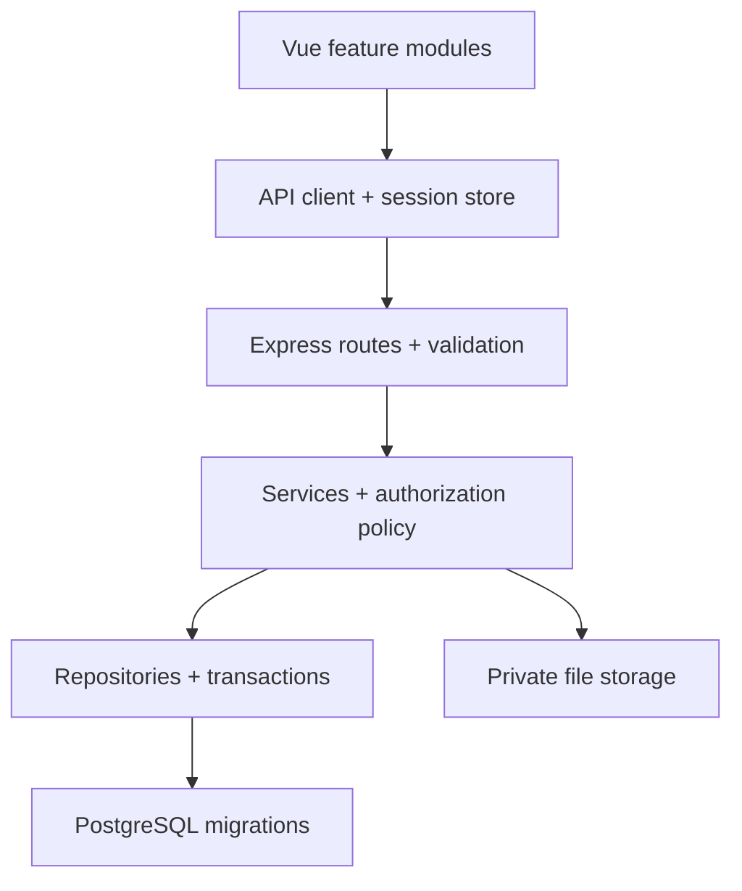

# Production Hardening & Modernization Plan

## IT Monitoring Assets — Vue.js, Express.js, PostgreSQL

> Audit snapshot: `muhhlmy/it-monitoring-assets`, branch `main`, commit
> `aca4f33`, 30 Juli 2026.
>
> Dokumen ini mendefinisikan “perfect” sebagai **production-ready, aman,
> teruji, mudah dirawat, efisien, dan dapat dipulihkan**. Bukan sebagai rewrite
> besar atau penambahan fitur tanpa batas.

## 1. Tujuan

Merapikan dan mengeraskan aplikasi Manajemen Aset TI dan Ticketing tanpa
merusak data atau alur bisnis yang sudah berjalan.

Prinsip utama:

1. Perbaiki keamanan dan integritas data sebelum refactor tampilan.
2. PostgreSQL migration menjadi satu-satunya sumber perubahan skema.
3. Backend selalu menjadi sumber kebenaran untuk autentikasi dan otorisasi.
4. Refactor dilakukan bertahap, dengan test sebelum dan sesudah perubahan.
5. Hapus file, dependency, dan abstraksi hanya jika terbukti tidak dipakai.
6. Pertahankan Vue 3, Express 5, PostgreSQL, JavaScript, dan ES Modules.
7. Jangan migrasi ke TypeScript, microservices, GraphQL, atau ORM besar tanpa
   ADR, bukti manfaat, dan persetujuan terpisah.

## 2. Definition of Done

Program dianggap production-ready jika semua kondisi berikut terpenuhi:

- Tidak ada password plaintext, fallback secret, token pada URL, atau data
  autentikasi di hasil ekspor.
- Semua endpoint memiliki autentikasi, permission, dan resource scope yang
  diuji dari backend.
- Fresh database dan database existing dapat dimigrasikan secara repeatable.
- Tidak ada `CREATE TABLE`, `ALTER TABLE`, seed, atau backfill di request path.
- Semua operasi multi-query penting menggunakan transaksi.
- List endpoint memakai pagination, filter tervalidasi, dan batas maksimum.
- Attachment tidak lagi disimpan sebagai base64 di kolom `TEXT`.
- `lint`, format check, unit test, integration test, build, migration test, dan
  smoke E2E lulus di CI.
- Critical flow teruji: login, permission, CRUD aset, device cycle, pembuatan
  tiket, claim, reassign, komentar, resolve, rating, audit, dan export.
- Tidak ada vulnerability Critical/High tanpa exception tertulis dan expiry.
- Backup serta restore PostgreSQL pernah diuji, bukan hanya didokumentasikan.
- Deployment memiliki health/readiness check, structured log, request ID,
  graceful shutdown, dan prosedur rollback.
- Dokumentasi setup lokal, environment, migration, seed, deployment, dan
  troubleshooting sesuai dengan implementasi aktual.

## 3. Ringkasan Audit Saat Ini

| Prioritas | Temuan                                        | Bukti pada repo                                                                                                                                                                            | Target                                                                                                    |
| --------- | --------------------------------------------- | ------------------------------------------------------------------------------------------------------------------------------------------------------------------------------------------ | --------------------------------------------------------------------------------------------------------- |
| P0        | Password dan secret tidak aman                | Default DB password di `backend/src/config/env.js`; fallback JWT secret di auth; login dan CRUD user memakai password plaintext; `Seed.sql` berisi password plaintext                      | Secret wajib dari environment; password di-hash; seluruh secret aktif dirotasi                            |
| P0        | Full database export membuka data sensitif    | `/api/export` hanya memerlukan login; `full-db` mengekspor seluruh tabel, termasuk kolom password user                                                                                     | Batasi ke superadmin, redact secret, audit setiap export; lebih baik pindahkan backup penuh ke proses ops |
| P0        | Skema database tidak dapat dipercaya          | `backend/Schema.sql` tidak lengkap pada backfill `riwayat_pemakaian_aset`, mereferensikan `tickets` yang belum dibuat, sementara controller menjalankan DDL saat request                   | Migration berurutan dan terversi; schema snapshot hanya artefak hasil migration                           |
| P0        | Audit log dapat dipalsukan                    | `frontend/src/App.vue` menulis login sebagai identitas tetap; endpoint audit menerima nama, email, IP, dan browser dari client                                                             | Event audit dibuat server-side dari `req.user`, request, dan hasil aksi                                   |
| P0        | Otorisasi tidak konsisten                     | Router frontend menganggap string `'none'` sebagai truthy; middleware permission belum diterapkan merata; komentar tiket menerima nama/role client; item-level scope tiket belum konsisten | Policy tunggal di backend dan test matrix deny-by-default                                                 |
| P1        | Session/token berisiko bocor                  | JWT disimpan di `localStorage`; SSE mengirim token melalui query string                                                                                                                    | Same-origin secure HttpOnly cookie + CSRF, atau one-time SSE ticket jika cookie belum memungkinkan        |
| P1        | Attachment tidak scalable dan sulit diamankan | File dibaca sebagai Data URL lalu disimpan di kolom `TEXT`; validasi hanya berdasarkan MIME dari browser                                                                                   | Object storage privat, validasi byte/MIME/size server-side, metadata DB, authorized download              |
| P1        | CORS terlalu luas                             | Semua origin private-LAN otomatis diizinkan                                                                                                                                                | Allowlist eksplisit per environment; same-origin reverse proxy sebagai default                            |
| P1        | Bug integritas/data                           | View lokasi memakai `a.lokasi_aset` walau nilai dikosongkan saat aset di-assign; device-cycle ditutup setelah delete; nomor tiket memakai `COUNT(*) + 1`                                   | `COALESCE(k.lokasi_kerja, a.lokasi_aset)`, urutan transaksi benar, nomor tiket berbasis sequence          |
| P1        | Export contract tidak sinkron                 | Metadata ticket memakai nama kolom Inggris yang berbeda dengan tabel aktual; export HTML/Excel/PDF tidak meng-escape seluruh nilai                                                         | Contract tunggal, formula-injection protection, HTML escaping, integration test                           |
| P2        | File inti terlalu besar                       | `TicketsView.vue` 1.444 baris; `ExportView.vue` 925; `ticketController.js` 840; `UsersView.vue` 811; `AssetsView.vue` 797                                                                  | Pisahkan berdasarkan feature/use-case, bukan sekadar memindahkan baris                                    |
| P2        | Test memberi confidence palsu                 | Hanya sedikit test; `assetStats.test.js` menguji object dummy; `ticketAccessService.js` diuji tetapi tidak dipakai controller produksi                                                     | Test service yang benar-benar dipanggil, integration test HTTP+PostgreSQL, E2E critical flow              |
| P2        | Tooling dan aset duplikat                     | Root lockfile kosong; Tailwind dipasang melalui Vite dan PostCSS; token desain tersebar; beberapa file tampak tidak direferensikan                                                         | Pilih satu konfigurasi resmi, satu dependency model, dan hapus artefak setelah proof-of-use               |

## 4. Arsitektur Target



Aturan dependency:

- View tidak melakukan fetch, authorization, export, dan transformasi bisnis
  sekaligus.
- Route hanya menangani HTTP concern dan schema validation.
- Service menjalankan use-case dan authorization.
- Repository menjalankan query dan transaksi.
- Controller tidak menjalankan DDL, seed, atau backfill.
- Policy akses dipanggil ulang pada setiap resource, bukan hanya pada menu.

Struktur yang disarankan:

```text
backend/
  migrations/
  src/
    modules/
      auth/
      assets/
      tickets/
      users/
      exports/
    middleware/
    db/
    lib/
  tests/
    unit/
    integration/

frontend/src/
  app/
  features/
    auth/
    assets/
    tickets/
    users/
    exports/
  shared/
    api/
    components/
    composables/
    utils/
```

Tidak perlu memindahkan seluruh file sekaligus. Struktur target diterapkan saat
sebuah feature disentuh.

## 5. Model Otorisasi

Gunakan dua dimensi:

- **Level**: `none`, `read`, `write`, `admin`.
- **Scope**: `own`, `assigned`, `queue`, `all`.

Role hanya memberi default permission. Keputusan final selalu dibuat backend.

| Kapabilitas            | User                             | Admin/teknisi                                                                    | Superadmin                             |
| ---------------------- | -------------------------------- | -------------------------------------------------------------------------------- | -------------------------------------- |
| Aset                   | Baca aset sendiri                | Sesuai permission `assets`                                                       | Semua                                  |
| Tiket list/detail      | Tiket yang dilaporkan sendiri    | Assigned dan queue yang dipetakan                                                | Semua                                  |
| Komentar tiket         | Hanya resource yang dapat dibaca | Hanya assigned/queue                                                             | Semua                                  |
| Claim/reassign/resolve | Tidak                            | Sesuai queue dan rule assignee                                                   | Semua                                  |
| User management        | Tidak                            | Hanya jika policy secara eksplisit mengizinkan; tidak dapat mengelola superadmin | Semua, dengan proteksi last-superadmin |
| Log audit              | Event sendiri bila dibutuhkan    | Read sesuai policy                                                               | Semua                                  |
| Export data            | Hanya dataset yang boleh dibaca  | Dataset sesuai scope                                                             | Semua dataset non-secret               |
| Full backup            | Tidak                            | Tidak                                                                            | Melalui proses ops yang diaudit        |

Ketentuan:

- Default adalah deny.
- Nama role dinormalisasi menjadi satu enum: `user`, `admin`, `superadmin`.
- Jangan memakai `includes('admin')`.
- Client tidak boleh mengirim identitas aktor (`nama_pengguna`,
  `role_pengguna`) sebagai sumber kebenaran.
- Permission frontend hanya mengatur UX; bukan security boundary.

## 6. Rencana Eksekusi

### Phase 0 — Safety Baseline

Tujuan: membuat perubahan berikutnya dapat diverifikasi dan dipulihkan.

- Buat branch hardening; jangan bekerja langsung di `main`.
- Ambil backup database dan lakukan restore rehearsal ke database terpisah.
- Catat row count dan invariant tabel penting sebelum migrasi.
- Pin satu versi Node yang kompatibel untuk frontend dan backend.
- Putuskan dependency model:
  - rekomendasi: npm workspaces dan satu lockfile root; atau
  - pertahankan dua app independen dan hapus lockfile root yang kosong.
- Tambahkan script non-mutating:
  - `lint:check`
  - `format:check`
  - `test`
  - `test:integration`
  - `build`
- Buat smoke test untuk kondisi aplikasi saat ini.
- Dokumentasikan endpoint dan tabel aktual sebelum refactor.

Gate:

- Baseline build/test dapat dijalankan ulang.
- Backup dapat direstore.
- Setiap failure lama dicatat; tidak disamarkan sebagai failure baru.

### Phase 1 — P0 Security & Data Emergency Fix

#### Secrets dan password

- Hapus semua fallback secret/password dari source.
- Validasi environment saat boot; aplikasi harus gagal start jika secret wajib
  tidak tersedia.
- Rotasi DB password, JWT/session secret, dan credential lain yang pernah
  tersimpan di source atau history.
- Ubah kolom menjadi `password_hash`.
- Hash password saat create/update dengan cost yang dikonfigurasi.
- Migrasikan password existing secara one-time tanpa mencetak nilainya, atau
  paksa reset password jika provenance datanya tidak dapat dipercaya.
- Seed hanya untuk development/test dan harus memakai hash.
- Tambahkan rate limit login, generic credential error, dan lockout/backoff yang
  tidak memungkinkan account enumeration.

#### Session

- Rekomendasi deployment: frontend dan API same-origin.
- Simpan session/token dalam cookie `HttpOnly`, `Secure`, dan `SameSite`.
- Terapkan CSRF protection untuk state-changing request.
- Jangan menyimpan token di URL atau `localStorage`.
- SSE memakai cookie same-origin. Jika belum memungkinkan, gunakan token SSE
  one-time dengan TTL singkat, bukan access token utama.

#### Export

- Hapus password hash, secret, token, dan field privat dari semua schema export.
- Batasi metadata, custom export, dan quick export berdasarkan policy + scope.
- Pindahkan full backup keluar dari endpoint aplikasi ke job ops.
- Jika endpoint sementara tetap ada: superadmin-only, re-authentication,
  audit log, rate limit, enkripsi, dan expiry.
- Escape HTML dan cegah CSV/spreadsheet formula injection.

#### Audit

- Hapus blok audit login hard-coded dari `frontend/src/App.vue`.
- Hapus kemampuan client menentukan identitas/IP aktor.
- Catat login sukses/gagal di auth service.
- Catat create/update/delete/export/permission changes di service yang melakukan
  transaksi.
- Simpan actor ID, action code, resource type/ID, result, request ID, timestamp,
  dan metadata perubahan yang sudah disanitasi.

Gate:

- Pencarian secret tidak menemukan credential/fallback aktif.
- Tidak ada password plaintext pada DB, seed, log, response, atau export.
- User biasa dan admin non-super tidak dapat mengambil backup penuh.
- Audit actor tidak dapat dipalsukan dari request body.

### Phase 2 — Database & Migration

- Pilih migration runner yang matang dan kompatibel dengan `pg`.
- Buat baseline migration untuk database kosong.
- Buat forward migration aman untuk database existing.
- Tambahkan tabel pencatat migration.
- Pindahkan seluruh DDL dari:
  - `ticketController.js`
  - `queueController.js`
  - `authController.js`
  - `userController.js`
- Pindahkan seed contoh ke perintah development/test yang eksplisit.
- Perbaiki `Schema.sql`; setelah migration stabil, jadikan generated snapshot
  atau hapus sebagai sumber kebenaran.
- Tambahkan FK untuk ticket log, comment, rating, queue, reporter, assignee, dan
  resolver sesuai retention policy.
- Tambahkan unique/check constraint:
  - role dan permission level
  - status/prioritas tiket
  - status/kondisi aset
  - rating 1–5
  - satu device-cycle aktif per aset
- Gunakan `TIMESTAMPTZ`. Konversi timestamp existing dengan legacy timezone yang
  disepakati; jangan mengasumsikan UTC.
- Perbaiki view lokasi menjadi lokasi karyawan ketika assigned dan lokasi aset
  ketika unassigned.
- Buat sequence aman untuk nomor tiket; jangan memakai `COUNT(*) + 1`.
- Perbaiki urutan device-cycle: tutup record aktif sebelum delete aset.
- Tambahkan index dari query aktual dan validasi dengan `EXPLAIN ANALYZE`.
- Tambahkan migration smoke test untuk fresh install dan upgrade dari snapshot.

Gate:

- Fresh migration + seed test lulus.
- Upgrade copy database existing lulus tanpa kehilangan row.
- Request normal tidak memiliki hak atau kebutuhan menjalankan DDL.
- Invariant dan FK check lulus.

### Phase 3 — Backend Boundary, Policy, dan API

- Tambahkan runtime request/response validation.
- Normalisasi error envelope:

```json
{
  "error": {
    "code": "TICKET_FORBIDDEN",
    "message": "Anda tidak memiliki akses.",
    "requestId": "..."
  }
}
```

- Terapkan policy terpusat untuk setiap list dan item action.
- Integrasikan `ticketAccessService.js` ke production atau hapus setelah
  penggantinya aktif; jangan membiarkan test menguji code yang tidak digunakan.
- Jangan percaya field actor dari client pada komentar/audit.
- Pastikan admin queue tidak dapat membaca atau mengubah tiket queue lain.
- Tambahkan pagination berbasis cursor atau page/limit tervalidasi dengan batas
  maksimum.
- Hilangkan dual-write nama teks (`pelapor`, `assigned_to`) setelah snapshot
  migration tersedia; gunakan ID sebagai relasi dan snapshot hanya untuk audit.
- Pecah controller besar per use-case:
  - ticket query
  - ticket command
  - comment
  - assignment
  - rating
  - stats
- Gunakan transaksi untuk user+queue mapping, resolve+audit, rating+audit, dan
  asset+history.
- Tambahkan security headers, strict payload limits, proxy config yang benar,
  allowlist CORS, dan structured logger dengan redaction.
- Health endpoint dipisahkan menjadi liveness dan readiness.
- Dokumentasikan API dengan OpenAPI yang diuji terhadap implementation.

Gate:

- Authorization matrix integration test lulus untuk allow dan deny.
- Tidak ada IDOR pada ticket, comment, asset, log, user, atau export.
- Semua list endpoint dibatasi dan terukur.
- Controller tidak lagi menjadi campuran policy, query, schema mutation, dan
  response formatting.

### Phase 4 — Attachment Pipeline

- Buat tabel metadata attachment dengan owner/resource, storage key, MIME,
  ukuran, checksum, status scan, creator, dan timestamp.
- Upload menggunakan endpoint multipart atau signed upload.
- Simpan object secara privat, nama acak, tanpa memakai nama file user sebagai
  path.
- Validasi:
  - maksimum ukuran
  - MIME berdasarkan bytes
  - ekstensi
  - dimensi gambar bila relevan
  - malware scan bila infrastruktur tersedia
- Download melalui endpoint yang memeriksa resource policy.
- Hapus EXIF/sensitive metadata untuk gambar jika requirement mengizinkan.
- Migrasikan base64 existing dengan script resumable dan laporan hasil.
- Setelah verifikasi, hapus kolom `attachment TEXT`.

Gate:

- File berbahaya, terlalu besar, dan resource tanpa izin ditolak.
- Database tidak lagi membesar karena Data URL.
- Migrasi attachment dapat dilanjutkan setelah interruption.

### Phase 5 — Frontend Modularity, UX, dan Performance

- Buat satu session store/composable yang tahan corrupted storage dan melakukan
  bootstrap dari `/api/auth/me`.
- Router guard memakai level eksplisit; `'none'` harus benar-benar ditolak.
- Lazy-load seluruh route feature.
- Pindahkan API call dan transformasi dari view ke feature services/composables.
- Pecah hotspot:
  - `TicketsView.vue`
  - `ExportView.vue`
  - `UsersView.vue`
  - `AssetsView.vue`
  - `SubmissionsView.vue`
- Batas praktis: satu komponen memiliki satu tanggung jawab; ukuran baris hanya
  sinyal, bukan target kosmetik.
- Gunakan komponen bersama untuk modal, table state, pagination, form error,
  confirmation, toast, loading, dan empty state.
- Konsolidasikan utilitas export; sanitasi semua nilai sebelum HTML/CSV/Excel.
- Pilih satu istilah bisnis untuk CASP/CSAT setelah konfirmasi stakeholder, lalu
  gunakan konsisten pada UI, API, test, dan dokumentasi.
- Pilih satu sumber design token.
- Pilih satu integrasi Tailwind yang tervalidasi; repo saat ini mengaktifkan
  plugin Vite dan PostCSS sekaligus.
- Tambahkan abort/debounce untuk request pencarian dan cegah stale response.
- Uji keyboard navigation, focus trap modal, label form, contrast, live region,
  responsive table, dan reduced motion.
- Tetapkan performance budget setelah baseline bundle dan Web Vitals diukur.

Gate:

- Route permission benar untuk `none`, `read`, dan `write`.
- Tidak ada feature page yang mengandung seluruh data layer, policy, modal, dan
  export dalam satu file.
- Build tidak menghasilkan warning yang belum diputuskan.
- Critical flow lolos accessibility smoke test.

### Phase 6 — Test Strategy & CI

Backend:

- Unit test untuk validator, policy, numbering, dan domain transition.
- Integration test dengan PostgreSQL nyata untuk route+query+transaction.
- Security regression test untuk IDOR, role spoofing, export redaction,
  attachment access, rate limit, dan CSRF.
- Concurrency test untuk nomor tiket, claim, CASP satu-kali, dan assignment.

Frontend:

- Component test untuk login, permission guard, forms, modal, dan error state.
- Test composable API/session/SSE.
- E2E untuk:
  - login/logout
  - user melihat aset sendiri
  - create ticket
  - admin queue claim/reassign/resolve
  - reporter memberi rating
  - export yang diizinkan

CI:

1. `npm ci`
2. secret scan
3. `lint:check`
4. `format:check`
5. unit test
6. migration + integration test
7. frontend build
8. E2E smoke
9. dependency/license scan

Gate:

- CI read-only untuk lint/format; tidak memakai `--fix`.
- Branch protection mewajibkan seluruh gate.
- Test gagal bila production service tidak memakai policy yang diuji.

### Phase 7 — Deployment, Observability, dan Recovery

- Buat image production multi-stage dan jalankan sebagai non-root.
- Jalankan migration sebagai langkah deployment terpisah sebelum traffic.
- Gunakan reverse proxy same-origin untuk frontend, API, dan SSE.
- Tambahkan request ID, structured JSON log, redaction, dan retention.
- Tambahkan metric minimum:
  - request rate/error/duration
  - DB pool saturation
  - login failure
  - queue ticket backlog
  - SSE connection count
  - upload failure
- Tambahkan alert untuk error rate, readiness, DB, dan backup failure.
- Buat runbook incident, migration failure, restore, dan secret rotation.
- Uji graceful shutdown dan rollback aplikasi.
- Untuk migration yang tidak backward-compatible, gunakan pola
  expand-migrate-contract.

Gate:

- Staging deployment dan rollback drill lulus.
- Restore backup lulus dengan data terverifikasi.
- Tidak ada secret di image, log, atau client bundle.

### Phase 8 — Cleanup & Documentation

#### Hapus setelah replacement aktif

- Empty root `package-lock.json`, kecuali diganti menjadi lockfile workspace yang
  valid.
- Fake audit request di `frontend/src/App.vue`.
- Runtime DDL/seed/backfill di controller.
- Fallback secret dan plaintext password flow.
- Duplicate permission constants serta variasi role.
- Kolom legacy dan dual-write setelah migration serta compatibility window
  selesai.

#### Verifikasi dengan `rg`, build, dan test sebelum menghapus

- `frontend/src/components/ui/StatCard.vue` — tidak ditemukan referensi pada
  source yang diaudit.
- `frontend/public/ESB Logo Mark.svg` — tidak ditemukan referensi setelah
  perubahan sidebar terbaru.
- `frontend/ui.html` — prototype HTML statis, tidak direferensikan aplikasi.
- `frontend/template.pdf` — tidak direferensikan source.
- Salah satu atau beberapa utilitas export setelah `exportAssetsCsv.js`,
  `exportAssetsPdf.js`, dan `exportEngine.js` dikonsolidasikan.
- Salah satu konfigurasi Tailwind/PostCSS setelah jalur build tunggal dipilih.
- `backend/src/config/seedUsers.js` setelah seed aman dan terpadu tersedia.
- `backend/src/config/checkSchema.js` setelah migration smoke test menggantikan
  fungsinya.

Jika prototype atau PDF masih bernilai sebagai referensi desain, pindahkan ke
`docs/design/` dan jelaskan statusnya; jangan membiarkannya terlihat seperti
runtime dependency.

#### Jangan langsung dihapus

- `backend/src/services/ticketAccessService.js`: gunakan sebagai policy aktif
  atau ganti dengan policy baru, baru putuskan penghapusan.
- `Schema.sql`: pertahankan sementara untuk recovery comparison sampai migration
  baru tervalidasi.
- Field legacy ticket: pertahankan selama compatibility window dan ukur
  pemakaiannya sebelum contract.

## 7. Urutan Pull Request

1. `ci/baseline-and-safety`
2. `security/secrets-passwords-audit`
3. `db/versioned-migrations`
4. `security/authorization-policy`
5. `security/export-and-attachments`
6. `refactor/backend-feature-modules`
7. `refactor/frontend-feature-modules`
8. `ops/deployment-observability-docs`

Setiap PR:

- Fokus pada satu tujuan.
- Menyertakan test dan migration/rollback notes.
- Tidak mencampur formatting massal dengan perubahan perilaku.
- Menjelaskan data yang berubah dan cara verifikasinya.
- Tidak menghapus compatibility code sebelum telemetry/test membuktikan aman.

## 8. Estimasi Kasar

Untuk satu engineer berpengalaman, setelah requirement dan akses staging jelas:

| Area                       | Estimasi    |
| -------------------------- | ----------- |
| Baseline + P0 security     | 4–7 hari  |
| Migration dan data repair  | 4–7 hari  |
| Backend policy/refactor    | 6–10 hari |
| Attachment dan export      | 4–7 hari  |
| Frontend modularization    | 7–12 hari |
| Test, CI, ops, dokumentasi | 6–10 hari |

Total realistis: sekitar 6–10 minggu termasuk review, QA, dan staging. Estimasi
harus diperbarui setelah database existing, deployment target, dan requirement
attachment/backup diketahui.

## 9. Keputusan yang Harus Dikunci

Sebelum Phase 2–4:

- Deployment same-origin atau cross-origin.
- Canonical term: CASP atau CSAT.
- Retention policy untuk audit, komentar, attachment, dan backup.
- Role/permission matrix final.
- Batas ukuran serta tipe attachment.
- Apakah full backup memang fitur aplikasi atau tanggung jawab ops.
- Legacy timezone timestamp.
- Apakah `Submissions` merupakan fitur aktif atau prototype.
- Apakah prototype `ui.html` dan `template.pdf` perlu diarsipkan.

## 10. Checklist Release

- [ ] Secret aktif sudah dirotasi.
- [ ] Password existing sudah di-hash/reset.
- [ ] Migration fresh dan upgrade lulus.
- [ ] Authorization matrix allow/deny lulus.
- [ ] Full export tidak mengandung credential.
- [ ] Audit actor berasal dari server.
- [ ] Token tidak ada di URL/localStorage.
- [ ] Attachment privat dan tervalidasi.
- [ ] Critical integration dan E2E test lulus.
- [ ] CI, build, dependency scan lulus.
- [ ] Backup/restore drill lulus.
- [ ] Staging smoke test lulus.
- [ ] Rollback procedure diuji.
- [ ] Dokumentasi sesuai implementasi.
- [ ] Dead code dan artefak sudah dihapus atau diarsipkan dengan bukti.
