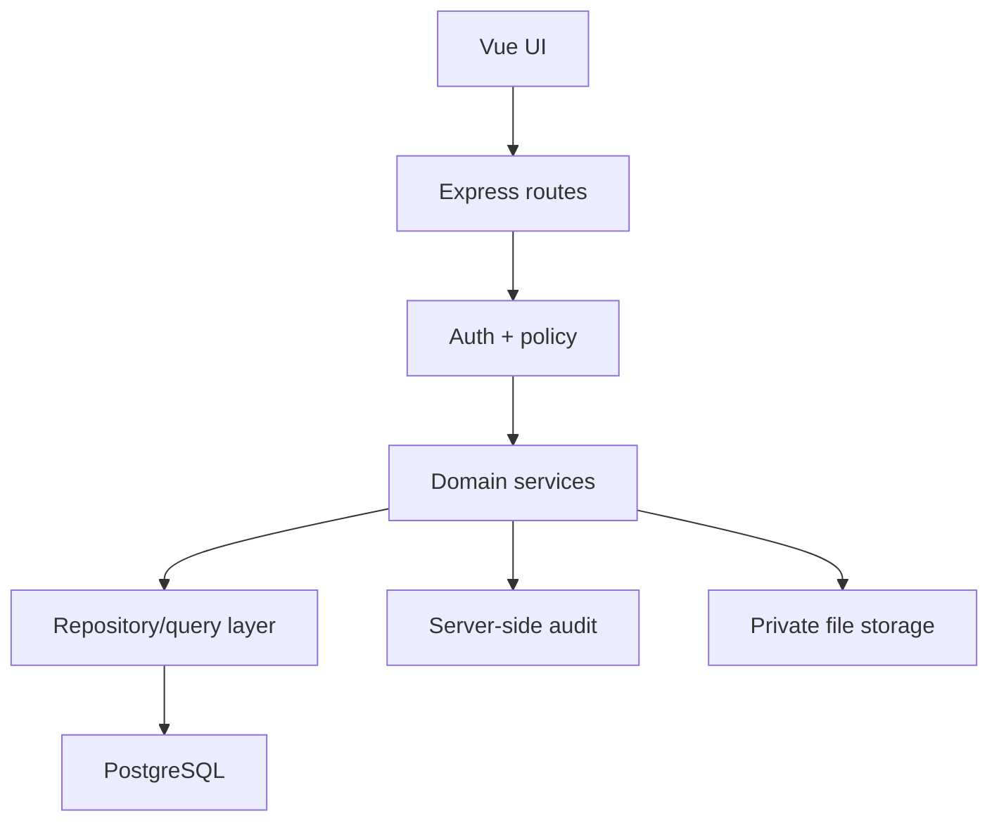

# Hardening Continuation Plan

## Review branch `hardening/phase0-p0-slice-1`

> Repository: `muhhlmy/it-monitoring-assets`
> Base: `main@aca4f33`
> Branch head yang diperiksa: `603b6f22507a984b46150bf3b7a362858c83b236`
> Tanggal pemeriksaan: 30 Juli 2026
> Stack yang dipertahankan: Vue 3, Express 5, PostgreSQL, JavaScript, ES Modules

## 1. Kesimpulan

**Verdict branch: REQUEST CHANGES sebelum merge.**

Implementasi inti slice pertama bergerak ke arah yang benar:

- fallback `DB_PASSWORD` dan `JWT_SECRET` sudah dihapus;
- backend sekarang fail-fast ketika secret wajib tidak tersedia;
- signing dan verification JWT memakai satu sumber konfigurasi;
- endpoint serta UI full-database export sudah dihapus;
- script lint dibedakan menjadi mode check dan fix;
- regression test untuk secret dan endpoint full database telah ditambahkan;
- baseline hardening sudah didokumentasikan.

Namun branch belum layak disebut menyelesaikan P0. Alasan utama:

1. `Plan.md` dan `Prompt.md` yang ditambahkan ke branch rusak encoding
   (mojibake) dan masih menunjuk snapshot `main`,
   sehingga dokumen eksekusi tidak akurat.
2. Password seluruh akun yang diperiksa masih non-bcrypt dan alur login,
   create user, update user, serta seed masih memakai plaintext.
3. Export kustom tetap tersedia untuk **setiap user terautentikasi**, termasuk
   dataset pengguna, karyawan, dan audit login.
4. Audit login dan komentar tiket masih menerima identitas aktor dari client.
5. Akses detail tiket, komentar, history, dan CASP belum memakai satu policy
   resource-scope yang konsisten.
6. DDL dan backfill masih berjalan dari request path.
7. JWT masih disimpan di `localStorage`, sedangkan SSE masih menerima token
   melalui query string.
8. Backup/restore rehearsal belum dilakukan.
9. Commit head tidak memiliki GitHub status check atau workflow run.

Dengan kata lain, slice ini adalah **containment yang berguna**, bukan tanda
bahwa aplikasi sudah production-ready.

## 2. Ruang Lingkup Pemeriksaan

Pemeriksaan dilakukan secara read-only terhadap:

- perbandingan `main` dengan branch;
- 17 file yang berubah;
- konfigurasi environment dan JWT;
- routing serta controller export;
- autentikasi, otorisasi, ticketing, audit, dan attachment;
- manifest npm, lockfile, script lint/build/test;
- test baru;
- baseline hardening;
- file source terbesar dan pola risiko pada 69 file, sekitar 15.320 baris;
- status check dan workflow GitHub pada commit head.

Tidak dilakukan:

- perubahan pada branch GitHub;
- migration, seed, backfill, atau query tulis;
- pengujian terhadap database production;
- rotasi secret;
- deployment;
- klaim bahwa hasil test lokal dalam dokumen branch telah direproduksi oleh CI.

## 3. Penilaian Perubahan Slice 1

| Area | Status | Penilaian | Tindakan |
| --- | --- | --- | --- |
| Secret database | Selesai untuk source | Fallback password dihapus dan boot fail-fast | Pastikan secret deployment tersedia dan rotasi credential lama |
| JWT secret | Selesai untuk source | Signing dan verification memakai `env.jwt.secret` | Rotasi secret deployment dan dokumentasikan invalidasi token lama |
| Full database export | Selesai sebagai containment | Route, controller, dan UI lama dihapus; test memastikan `404` tanpa query | Jangan aktifkan kembali sebagai endpoint aplikasi |
| Export kustom | Belum aman | Hanya dilindungi `authenticateToken`; semua user login dapat meminta dataset sensitif | Batasi sementara ke superadmin, lalu bangun policy export eksplisit |
| Test secret | Baik, sebagian brittle | Perilaku fail-fast diuji; sebagian assertion memeriksa teks source | Pertahankan behavior test, kurangi source-pattern test bertahap |
| Test full DB export | Baik untuk regression | Membuktikan route lama `404`; database dimock | Tambahkan test role matrix dan integration test database terisolasi |
| Script lint | Membaik | Mode check tidak lagi melakukan mutation | Bayar baseline 5 oxlint, 31 ESLint, dan 33 file format secara terkontrol |
| Runtime pin | Parsial | `.nvmrc` berisi Node `24.16.0` | Selaraskan `engines`, CI, README, dan runtime deployment |
| Dependency model | Diputuskan | Backend dan frontend dianggap package independen | Hapus root `package-lock.json` kosong agar tidak menyesatkan |
| Baseline doc | Berguna, perlu koreksi | Data baseline cukup jelas | Jelaskan bahwa Plan/Prompt awalnya untracked lalu ditambahkan; perbarui status |
| Plan/Prompt branch | Gagal kualitas | Encoding rusak dan snapshot sudah stale | Ganti dengan dokumen UTF-8 yang mengacu ke head branch |
| CI | Belum ada bukti | Commit tidak memiliki status check/workflow run | Tambahkan workflow read-only untuk backend check/test dan frontend gates |

## 4. Temuan Terprioritas

### P0 — Harus ditangani sebelum production

#### P0-01 — Password plaintext

**Bukti**

- `backend/src/controllers/authController.js` membandingkan
  `password === user.password`.
- `backend/src/controllers/userController.js` menyimpan nilai password dari
  request secara langsung saat create dan update.
- `backend/Seed.sql` masih berisi akun dengan password non-hash.
- Baseline branch mencatat 4 dari 4 akun masih non-bcrypt.

**Risiko**

Kebocoran database langsung menjadi kebocoran seluruh credential. Tidak ada
proteksi yang cukup terhadap credential reuse.

**Tindakan**

1. Lakukan backup dan restore rehearsal pada database terisolasi.
2. Gunakan `bcryptjs` yang sudah menjadi dependency.
3. Hash password baru dengan cost yang dikonfigurasi dan memiliki batas aman.
4. Migrasikan akun existing secara repeatable.
5. Hapus dukungan plaintext setelah rollout; jangan mempertahankan fallback
   plaintext tanpa expiry.
6. Hapus credential nyata dari seed; seed hanya boleh memakai nilai development
   yang eksplisit dan tidak bisa berjalan di production.
7. Uji login benar/salah, create, update, inactive user, dan hash tidak pernah
   muncul di response atau log.

**Blocker:** backup/restore rehearsal dan strategi rollout.

#### P0-02 — Export kustom tidak memiliki authorization boundary

**Bukti**

- `router.use('/api/export', authenticateToken, exportRouter)`.
- `/api/export/tables` dan `/api/export/data` tidak memakai `authorizeRoles`
  atau `authorizePermission`.
- Whitelist mencakup `users`, `karyawan`, `log_audit_login`, dan data operasional
  lain.
- Test sukses hanya menggunakan token superadmin dan tidak menguji penolakan
  role lain.

**Risiko**

User biasa yang memiliki token valid dapat mengekspor PII, daftar akun, dan
audit login. Frontend permission bukan security boundary.

**Tindakan containment berikutnya**

- batasi kedua endpoint ke `superadmin` sebagai default aman;
- tambahkan matrix test: tanpa token `401`, user `403`, admin `403`,
  superadmin `200`;
- pastikan field `password` tidak pernah tersedia;
- audit siapa mengekspor apa, tetapi actor harus berasal dari `req.user`;
- setelah kebutuhan bisnis dikunci, ganti role-only check dengan policy
  dataset/column/scope yang eksplisit.

#### P0-03 — Audit dapat dipalsukan oleh client

**Bukti**

- `frontend/src/App.vue` mengirim login audit setiap mount dengan nilai tetap
  `Admin IT`, `admin@esb.co.id`, dan `127.0.0.1`.
- `POST /api/logs/audit` menerima `nama_pengguna`, `email`, `aktifitas`,
  `ip_address`, dan `browser` dari body.
- Login sukses/gagal sebenarnya sudah dicatat di backend auth controller.

**Risiko**

Log audit tidak dapat dipercaya, menduplikasi login, dan memungkinkan user
terautentikasi menulis identitas atau IP palsu.

**Tindakan**

- hapus side effect audit dari `App.vue`;
- hapus endpoint client-writable jika tidak diperlukan;
- jika logout audit diperlukan, sediakan endpoint aksi logout yang mengambil
  actor dari `req.user`, IP dari request, dan user-agent dari header;
- definisikan allowlist event audit di backend;
- tolak atau abaikan field actor yang dikirim client;
- uji spoofing actor.

#### P0-04 — Resource authorization ticket belum konsisten

**Bukti**

- route history, comments, CASP, dan sebagian listing hanya mengandalkan
  autentikasi global;
- `createTicketComment` hanya mengecek keberadaan dan status tiket;
- `nama_pengguna` dan `role_pengguna` dari request body mengalahkan `req.user`;
- rule queue sudah ada pada claim/reassign, tetapi belum dipakai sebagai policy
  bersama untuk read/comment/history.

**Risiko**

User dapat membaca atau mengomentari tiket yang bukan miliknya atau di luar
queue-nya, serta memalsukan identitas komentar.

**Tindakan**

- buat policy service tunggal untuk `canReadTicket`, `canCommentTicket`,
  `canManageTicket`, `canRateTicket`;
- reporter hanya mengakses tiket miliknya;
- admin hanya mengakses queue yang ditugaskan;
- assignee mengakses tiket yang ditangani;
- superadmin boleh mengakses semua;
- actor komentar hanya dari `req.user`;
- terapkan policy pada list, history, comments, CASP, update, delete, claim, dan
  reassign;
- tambahkan negative tests untuk IDOR dan cross-queue.

#### P0-05 — DDL/backfill masih berjalan saat request

**Bukti**

- auth dan user controller masih menjalankan `ALTER TABLE ... IF NOT EXISTS`.
- ticket dan queue controller masih memiliki beberapa `CREATE TABLE`,
  `ALTER TABLE`, atau backfill helper.
- `Schema.sql` belum menjadi sumber fresh install yang dapat dipercaya.

**Risiko**

Race condition, lock saat traffic, privilege database berlebihan, deployment
yang tidak repeatable, serta perbedaan schema antar-environment.

**Tindakan**

- pilih migration runner ringan atau mekanisme SQL versioned;
- buat baseline migration yang tervalidasi;
- pindahkan seluruh DDL, seed, dan backfill keluar request path;
- jalankan migration sebelum aplikasi menerima traffic;
- uji fresh database, upgrade database existing, rerun idempotent, dan rollback
  atau forward-fix.

#### P0-06 — Belum ada recovery proof

**Bukti**

`docs/hardening-baseline.md` menyatakan backup/restore rehearsal belum
dilakukan.

**Risiko**

Migration password dan schema dapat merusak data tanpa jalur pemulihan yang
teruji.

**Tindakan**

- buat backup operasional di luar endpoint aplikasi;
- enkripsi dan batasi akses artefak backup;
- restore ke database terisolasi;
- bandingkan row count serta constraint;
- catat durasi, owner, lokasi artefak, dan hasil;
- jadikan bukti restore sebagai gate untuk migration berisiko.

### P1 — Security, correctness, dan operasional

#### P1-01 — Token di `localStorage` dan query string

- JWT dibaca dari `localStorage` di auth, API composable, router, dan SSE.
- middleware menerima `?token=...`.
- Query token dapat muncul di browser history, proxy log, access log, dan
  telemetry.

Target: session cookie `HttpOnly`, `Secure`, `SameSite` dengan CSRF strategy,
atau mekanisme SSE aman yang tidak menaruh bearer token di URL. Perubahan ini
harus disiapkan sebagai migrasi kompatibel dan diuji lintas browser.

#### P1-02 — CORS mengizinkan seluruh private LAN

`backend/src/app.js` mengizinkan origin localhost dan semua alamat private
network tanpa harus tercantum pada `CORS_ORIGINS`.

Target: allowlist exact origin per environment; tanpa wildcard atau implicit
private-network bypass di production.

#### P1-03 — Export tidak dibatasi dan schema ticket stale

- default `limit = 'all'`;
- tidak ada hard cap atau pagination/streaming;
- metadata ticket memakai nama kolom Inggris seperti `created_at`,
  `ticket_number`, dan `subject`, sedangkan schema aktif memakai nama Indonesia
  seperti `dibuat_pada`, `nomor_tiket`, dan `judul`.

Target: kontrak metadata berasal dari schema/migration yang sama, request
memiliki hard cap, dan export besar menjadi job/stream terkontrol.

#### P1-04 — Permission frontend salah menilai string `none`

`return !!userPerms[key]` membuat string `none` bernilai `true`. Ini bukan
security boundary, tetapi menghasilkan UI yang salah dan memperbesar risiko
akses tak sengaja.

Target: normalisasi permission menjadi enum `none | read_only | full` di satu
tempat, lalu uji route guard dan action visibility.

#### P1-05 — Attachment base64 di request dan database

Body limit mencapai 10 MB dan ticket menyimpan `attachment` langsung. Base64
menambah ukuran, membebani memory, database, backup, dan response.

Target: object storage/private filesystem dengan metadata di PostgreSQL,
validasi MIME/signature/size, nama acak, authorization download, dan malware
scan bila tersedia.

#### P1-06 — Correctness transaksi dan nomor tiket

- nomor tiket memakai `COUNT(*) + 1`, rawan collision dan reuse setelah delete;
- beberapa operasi data + log + mapping queue belum berada dalam satu
  transaction;
- delete dan riwayat aset perlu diuji terhadap urutan operasi.

Target: database sequence/identity, unique constraint, dan transaction boundary
untuk seluruh invariant penting.

#### P1-07 — Output export/print perlu proteksi injection

Utility export menggunakan `document.write`; CSV/spreadsheet output perlu
menetralisir formula prefix seperti `=`, `+`, `-`, dan `@`.

Target: renderer aman, escaping HTML, formula neutralization, serta regression
test dengan payload berbahaya.

### P2 — Maintainability dan performance

#### P2-01 — File terlalu besar

Temuan ukuran terbesar:

| File | Baris |
| --- | ---: |
| `frontend/src/views/TicketsView.vue` | 1.444 |
| `frontend/src/views/ExportView.vue` | 900 |
| `backend/src/controllers/ticketController.js` | 840 |
| `frontend/src/views/UsersView.vue` | 811 |
| `frontend/src/views/AssetsView.vue` | 797 |
| `frontend/src/views/SubmissionsView.vue` | 789 |
| `frontend/src/views/MyAssetsView.vue` | 764 |

Target: pecah berdasarkan domain dan alasan perubahan, bukan sekadar mengejar
jumlah baris. Controller harus tipis; aturan bisnis dan policy dapat diuji tanpa
HTTP server.

#### P2-02 — Frontend bundle dan quality debt

- build memiliki chunk utama di atas 500 kB;
- baseline mencatat 5 error oxlint, 31 error ESLint, dan 33 file tidak sesuai
  format;
- route view utama masih eager-loaded.

Target: lazy-loaded route, chunk inspection, perbaikan lint bertahap tanpa
mass-format pada perubahan security, dan CI read-only.

#### P2-03 — Dokumentasi dan dependency hygiene

- root `package-lock.json` kosong meskipun model repo adalah dua package
  independen;
- Node version belum konsisten di seluruh manifest, CI, docs, dan deployment;
- Plan/Prompt di branch rusak encoding dan stale.

Target: satu keputusan package/runtime yang eksplisit, UTF-8 tervalidasi, dan
dokumentasi yang selalu menyebut commit snapshot serta status aktual.

## 5. Target Arsitektur



Aturan boundary:

- UI hanya membantu UX; backend selalu menegakkan security.
- Route melakukan parsing dan menghubungkan middleware.
- Policy memutuskan role, permission, ownership, queue, dan assignment.
- Service memegang transaksi serta invariant bisnis.
- Repository menyimpan SQL dan mapping data.
- Migration adalah satu-satunya pemilik DDL/backfill.
- Audit mengambil actor dari konteks server.
- File binary tidak disimpan sebagai base64 di row utama.

## 6. Model Otorisasi Target

| Aksi | User/reporter | Admin queue | Superadmin |
| --- | --- | --- | --- |
| Melihat tiket | Milik sendiri | Queue sendiri/assigned | Semua |
| Membuat tiket | Ya | Ya | Ya |
| Mengomentari tiket | Milik sendiri dan masih terbuka | Queue/assigned dan masih terbuka | Tiket terbuka |
| Claim | Tidak | Queue sendiri | Ya |
| Reassign | Tidak | Assignee saat ini dan target satu queue | Ya |
| Resolve/update | Tidak, kecuali aksi user yang eksplisit | Queue/assigned | Ya |
| Memberi CASP | Reporter setelah resolved | Tidak untuk tiket yang ditangani | Hanya bila reporter |
| Export sensitif | Tidak | Tidak secara default | Ya |
| Kelola user | Tidak | Terbatas sesuai policy final | Ya |
| Baca audit | Tidak | Jika disetujui | Ya |

Keputusan role admin untuk export dan audit harus dikunci bersama product owner.
Sampai ada keputusan, gunakan **superadmin-only**.

## 7. Urutan Eksekusi

### Slice 1A — Rapikan branch yang sedang diperiksa

Tujuan: membuat hasil slice pertama layak direview dan reproducible.

- ganti `Plan.md` dan `Prompt.md` dengan UTF-8 yang valid;
- ubah snapshot dokumen ke branch/head terbaru;
- tandai fallback secret dan full-db export sebagai selesai;
- koreksi narasi baseline tentang Plan/Prompt;
- hapus root lockfile kosong setelah memastikan dua-package model;
- selaraskan Node version di `.nvmrc`, `engines`, README, dan CI;
- tambahkan CI minimal jika scope review mengizinkan:
  - backend install reproducible, syntax check, test;
  - frontend install reproducible, build, lint check, format check;
  - lint/format lama boleh menjadi gate bertahap yang transparan, bukan
    disembunyikan.

**Gate**

- tidak ada mojibake;
- docs menyebut commit aktual;
- install memakai lockfile package masing-masing;
- commit memperoleh status checks.

### Slice 2 — Export containment dan audit integrity

Tujuan: menutup dua jalur kebocoran/pemalsuan tanpa migration database.

- jadikan seluruh route export superadmin-only sementara;
- tambahkan hard cap dan validasi limit;
- perbaiki metadata ticket agar sesuai schema aktif;
- pertahankan full-db route sebagai `404`;
- hapus fake login audit dari `App.vue`;
- hapus atau sempitkan `POST /api/logs/audit`;
- actor, IP, dan user-agent berasal dari server;
- tambahkan test role matrix, redaction, limit, contract, dan actor spoofing.

**Gate**

- user/admin non-super selalu `403` untuk export sensitif;
- `password` tidak dapat dipilih atau muncul;
- payload actor palsu tidak pernah masuk log;
- tidak ada regression pada login dan build frontend.

### Slice 3 — Ticket policy dan actor integrity

Tujuan: menutup IDOR/cross-queue dan pemalsuan komentar.

- buat policy service tunggal;
- terapkan pada list/detail/history/comment/CASP/manage;
- ambil actor komentar dari `req.user`;
- tambahkan test reporter, unrelated user, admin same queue, admin other queue,
  assignee, dan superadmin;
- jangan melakukan migration pada slice ini kecuali benar-benar diperlukan.

**Gate**

- semua negative authorization tests lulus;
- list dan SSE tidak membocorkan event tiket di luar scope;
- body tidak dapat mengubah actor.

### Slice 4 — Recovery rehearsal dan password migration

Tujuan: menghapus plaintext credential dengan jalur recovery yang dibuktikan.

- lakukan backup operasional;
- restore ke database terisolasi;
- catat verifikasi;
- implementasikan hash untuk akun baru/perubahan password;
- migrasikan akun existing;
- rotasi secret yang pernah menggunakan fallback;
- hapus fallback kompatibilitas plaintext.

**Gate**

- 0 password plaintext;
- semua login menggunakan hash;
- tidak ada password/hash di API, log, atau export;
- restore proof tersedia;
- rollback/forward-fix terdokumentasi.

### Slice 5 — Migration system dan penghapusan runtime DDL

Tujuan: menjadikan perubahan schema deterministic.

- inventaris seluruh DDL/backfill dalam controller;
- buat migration berurutan;
- perbaiki fresh schema;
- pindahkan seed keluar setup production;
- hapus semua `ensure*Table/ColumnExists` dari request path.

**Gate**

- fresh migrate lulus;
- upgrade snapshot existing lulus;
- rerun aman;
- aplikasi runtime tidak memiliki privilege DDL;
- tidak ada DDL pada route/controller/service.

### Slice 6 — Session, CORS, dan transport security

- migrasikan bearer token browser ke session cookie aman;
- siapkan CSRF protection;
- hapus token query SSE;
- gunakan exact CORS allowlist;
- tambahkan rate limit login dan security headers;
- uji logout, expiry, inactive user, CSRF, CORS, dan reconnect SSE.

### Slice 7 — Attachment pipeline

- pilih storage;
- migration metadata attachment;
- upload/download authorization;
- MIME/signature/size validation;
- streaming;
- cleanup orphan;
- test file berbahaya dan akses lintas user.

### Slice 8 — Data correctness dan transaction boundaries

- sequence nomor tiket;
- transaksi create/update/log;
- transaksi user + queue mapping;
- concurrency test claim dan numbering;
- constraint/index berdasarkan query nyata;
- pagination seluruh list endpoint.

### Slice 9 — Frontend modularity dan performance

- pecah `TicketsView`, `ExportView`, `UsersView`, dan controller ticket;
- konsolidasikan auth/permission;
- lazy-load routes;
- hilangkan `document.write`;
- perbaiki error/loading/empty state dan accessibility;
- bayar lint/format debt dalam PR terpisah dari security.

### Slice 10 — CI, observability, deployment, dan cleanup final

- required checks;
- dependency/security scanning;
- migration test;
- smoke E2E;
- structured logging dan correlation ID;
- health/readiness;
- metrics/alerts;
- runbook deploy, rollback, restore, dan incident;
- hapus kode/dependency hanya dengan bukti tidak dipakai.

## 8. Test Matrix Minimum

### Backend

- environment missing/blank/short secret;
- login success/failure/inactive/expired token;
- role dan permission matrix;
- ticket resource scope dan cross-queue denial;
- comment actor spoof;
- audit actor spoof;
- export unauthenticated/user/admin/superadmin;
- export redaction, invalid columns, invalid table, limit, date/search;
- full-db endpoint tetap `404`;
- transaction rollback;
- migration fresh/existing/rerun;
- password hash create/update/migration;
- concurrent ticket numbering/claim.

### Frontend

- route guard untuk `none`, `read_only`, dan `full`;
- action visibility sesuai permission;
- login/logout/session expiry;
- ticket detail/comment scope;
- export tidak tampil untuk role tanpa akses;
- upload validation;
- error/loading/empty state;
- accessibility dasar.

### E2E

1. user login dan hanya melihat data miliknya;
2. user membuat tiket dan komentar sebagai dirinya sendiri;
3. admin queue claim, update, dan resolve;
4. admin queue lain ditolak;
5. reporter memberi CASP;
6. superadmin mengekspor dataset yang diizinkan;
7. restore database terisolasi dan smoke test.

## 9. Quality Gates

Setiap slice harus:

- memiliki diff kecil dan satu tujuan utama;
- tidak menyentuh data production tanpa backup/restore proof;
- menambah test untuk bug atau boundary yang diperbaiki;
- menjalankan command read-only lebih dulu;
- tidak memakai `lint --fix` atau mass-format pada file yang tidak terkait;
- tidak memperlebar CORS, role, permission, body limit, atau export;
- tidak menaruh secret di source, fixture, log, atau dokumentasi;
- mendokumentasikan command, hasil, risiko tersisa, dan rollback;
- berhenti jika ditemukan perubahan user yang tumpang tindih;
- tidak commit, push, merge, atau deploy tanpa izin eksplisit.

Command minimum yang perlu tersedia:

```bash
cd backend
npm ci
DB_PASSWORD=test_password JWT_SECRET=01234567890123456789012345678901 npm run check

cd ../frontend
npm ci
npm run build
npm run lint:check
npm run format:check
```

Untuk migration/test database, gunakan database terisolasi. Jangan menjalankan
`seed`, backfill, atau migration terhadap database yang belum dipastikan target
dan backup-nya.

## 10. Definition of Done

Aplikasi baru boleh disebut production-ready bila:

- semua P0 ditutup;
- password seluruh akun berupa hash kuat;
- backend menegakkan role, permission, ownership, queue, dan assignment;
- audit tidak menerima actor dari client;
- tidak ada bearer token di URL;
- migration fresh dan existing repeatable;
- tidak ada DDL/backfill di request path;
- backup dan restore telah diuji;
- export memiliki scope, redaction, limit, dan audit yang aman;
- attachment berada di storage yang sesuai dan download terotorisasi;
- transaksi menjaga invariant lintas-query;
- lint, format, test, build, migration test, dan smoke E2E menjadi required CI;
- tidak ada vulnerability Critical/High tanpa exception ber-owner dan expiry;
- deploy, rollback, recovery, dan incident response terdokumentasi.

## 11. Keputusan yang Masih Harus Dikunci

Sebelum slice terkait dimulai, minta keputusan untuk:

1. Apakah admin biasa boleh export? Dataset dan kolom apa?
2. Apakah admin boleh membaca audit login?
3. Berapa retensi audit dan attachment?
4. Storage attachment yang tersedia?
5. Model session cookie dan domain deployment?
6. Target RPO/RTO serta owner backup?
7. Strategi rollout hash password: reset terkontrol atau transisi sekali login?
8. Apakah migration runner boleh menambah dependency?

Default aman bila belum ada jawaban:

- export dan audit hanya superadmin;
- tidak ada perubahan schema/data;
- tidak ada endpoint backup aplikasi;
- tidak ada token di URL;
- tidak ada actor dari body;
- tidak menghapus file/dependency tanpa bukti pemakaian.

## 12. Prioritas Praktis

Urutan paling aman dari branch ini:

1. perbaiki dokumen/encoding dan reproducibility branch;
2. tutup export kustom dan audit spoofing;
3. tegakkan ticket resource policy;
4. buktikan restore;
5. migrasikan password;
6. bangun migration system dan hapus runtime DDL;
7. lanjutkan session, attachment, correctness, modularity, CI, dan operasional.

Jangan memulai refactor UI besar sebelum P0 dan recovery gate selesai.
