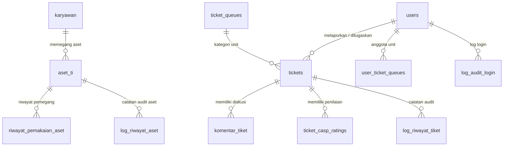

# ESB TrackIT — IT Assets Monitoring & Helpdesk Management System

**ESB TrackIT** adalah platform Enterprise IT Asset Monitoring dan Helpdesk Support Queue modern yang dirancang untuk mengelola inventaris perangkat TI perusahaan, tracking riwayat pemakaian aset karyawan, serta sistem manajemen tiket bantuan (helpdesk) berstandar modern B2B SaaS.

---

## 🚀 Fitur Utama & Modul Sistem

### 1. 💻 Asset Management (Manajemen Aset TI)
- **Master Data Aset TI**: Tracking lengkap hostname, nomor seri, spesifikasi, tipe perangkat (laptop, PC, server, dsb.), merek, model, lokasi, dan pemegang aset.
- **Kondisi & Status Aset**: Pengelolaan status (*In Use*, *Stock*, *Damaged*, *In Service*, *Disposal*) dan kondisi fisik (*Baru*, *Normal*, *Rusak Ringan/Sedang/Berat*).
- **Riwayat Pemakaian & Audit Log**: Catatan otomatis penyerahan/pengembalian aset ke karyawan serta log riwayat aktivitas perubahan data aset.

### 2. 👥 Employee Management (Master Data Karyawan)
- Database karyawan perusahaan (NIK, nama, departemen, direktotat, jabatan, lokasi kerja, email kantor, status kerja Permanent/Contract).
- Relasi hirarki atasan langsung (*NIK Atasan Langsung*) untuk eskalasi dan approval.

### 3. 🎫 Helpdesk Support Queue & Issue Inbox (Sistem Tiket)
- **Quiet Modern SaaS Inbox Interface**: Antarmuka antrean tiket modern berstandar *Linear / Vercel / Raycast* dengan arsitektur 2-level informasi tanpa visual noise berlebihan.
- **Ticket Queues (Unit Support)**: Pengelompokan tiket berdasarkan unit tujuan (*IT Helpdesk*, *Network Team*, *Software Support*, *Hardware Support*).
- **Multi-Role Workspace**:
  - **User / Reporter**: Membuat request tiket (*+ Request Ticket*), memantau progress kendala, berdiskusi, dan memberikan penilaian kepuasan (CASP).
  - **Admin & Superadmin**: Mengambil tiket (*Claim Ticket*), menetapkan penanggung jawab (*Assignee*), memperbarui status (*Open → In Progress → Pending → Resolved → Closed*), serta memantau SLA.
- **SLA & Timer Tracking**: Penghitungan mundur SLA berdasarkan tingkat prioritas (*Urgent: 4h*, *High: 1d*, *Medium: 3d*, *Low: 7d*).

### 4. ⭐ CASP Assessment (Customer Satisfaction Rating)
- Evaluasi kepuasan pengguna setelah tiket diselesaikan (*Resolved / Closed*).
- Rating bintang 1–5 (*Sangat Tidak Puas* s.d. *Sangat Puas*) dan feedback ulasan singkat.
- Validasi eligibility reaktif dan real-time tanpa memerlukan browser refresh.

### 5. 🔄 Real-Time SSE (Server-Sent Events) & Audit Trail
- Push notification & update status tiket secara real-time via Server-Sent Events (SSE).
- Log riwayat perubahan tiket (*Activity Timeline*) dan log audit login pengguna untuk keandalan keamanan.

---

## 🛠️ Teknologi & Arsitektur

### Frontend
- **Framework**: Vue 3 (Composition API `<script setup>`), Vue Router.
- **Styling**: Vanilla CSS, TailwindCSS utilities, HSL color tokens, Glassmorphism, Material Symbols Icons.
- **Build Tool**: Vite.

### Backend
- **Runtime & Server**: Node.js (ES Modules), Express.js.
- **Database**: PostgreSQL dengan `pg` Connection Pool & Client Transactions.
- **Keamanan**: JWT Authentication, Bcrypt Password Hashing, RBAC (Role-Based Access Control) & Scope Queue Security.
- **Real-Time**: Server-Sent Events (SSE).

---

## 🗄️ Skema Database (PostgreSQL)

Database `esb_trackit` terdiri dari 12 tabel utama dan 3 database views:



### Daftar Tabel Utama

1. **`karyawan`**: Data master karyawan perusahaan (NIK, Nama, Departemen, Email, Status).
2. **`users`**: Akun pengguna sistem & otentikasi (Role: `user`, `admin`, `superadmin`, Hashed Password, Permissions JSONB).
3. **`aset_ti`**: Master data inventaris aset TI (Hostname, Serial Number, Spesifikasi, Status, Kondisi, NIK Pemegang).
4. **`ticket_queues`**: Unit/tim helpdesk (Kode, Nama Unit, Status Aktif).
5. **`tickets`**: Tabel utama tiket bantuan (Nomor Tiket, Judul, Deskripsi, Prioritas, Status, Queue ID, Pelapor, Assignee, SLA).
6. **`komentar_tiket`**: Utasan diskusi dan lampiran gambar pada tiket.
7. **`ticket_casp_ratings`**: Penilaian kepuasan CASP (Rating 1–5 & Feedback) per tiket.
8. **`user_ticket_queues`**: Mapping penugasan admin ke unit helpdesk tertentu.
9. **`log_riwayat_tiket`**: Audit trail riwayat pergerakan & perubahan status tiket.
10. **`log_riwayat_aset`**: Audit trail perubahan data & mutasi aset TI.
11. **`riwayat_pemakaian_aset`**: History pemegang aset TI dari waktu ke waktu.
12. **`log_audit_login`**: Record aktivitas login pengguna (IP Address, User Agent, Timestamp).

### Database Views

- **`daftar_aset_ti_lengkap`**: View agregasi detail aset TI beserta informasi karyawan pemegang.
- **`v_ticket_stats_per_queue`**: View rekapitulasi statistik tiket open/closed per unit helpdesk.
- **`v_employee_asset_summary`**: View ringkasan jumlah aset TI yang dipegang oleh masing-masing karyawan.

---

## 📁 Struktur Direktori Project

```text
it-monitoring-assets/
├── backend/
│   ├── esb_trackit_db.sql           # File Skema SQL PostgreSQL & Seed Data Init
│   ├── package.json
│   └── src/
│       ├── config/                  # Database connection, Schema Verification, Migrations
│       ├── controllers/             # Express controllers (Asset, Ticket, Auth, Export, etc.)
│       ├── middleware/              # Auth & Permission verification middleware
│       ├── routes/                  # Express API Routes
│       ├── services/                # Ticket Access Policy & SSE Realtime Service
│       └── index.js                 # Entry point server Express
├── frontend/
│   ├── package.json
│   ├── vite.config.js
│   └── src/
│       ├── assets/                  # CSS styles & design tokens
│       ├── components/              # Reusable UI Components (AppModal, AppBadge, TicketCaspRating, etc.)
│       ├── composables/             # Vue Composables (useAuth, useApi, useTicketRealtime)
│       ├── router/                  # Vue Router configuration
│       └── views/                   # Application Pages (AssetsView, TicketsView, DashboardView, etc.)
└── README.md
```

---

## ⚡ Instalasi & Cara Menjalankan

### Prasyarat
- **Node.js**: v18.x atau versi lebih baru
- **PostgreSQL**: v14.x atau versi lebih baru

### 1. Setup Database PostgreSQL
1. Buat database baru bernama `esb_trackit` di PostgreSQL:
   ```sql
   CREATE DATABASE esb_trackit;
   ```
2. Eksekusi file SQL skema `backend/esb_trackit_db.sql` ke database `esb_trackit`:
   ```bash
   psql -U postgres -d esb_trackit -f backend/esb_trackit_db.sql
   ```

### 2. Setup Server Backend
1. Masuk ke direktori `backend/`:
   ```bash
   cd backend
   ```
2. Install dependensi:
   ```bash
   npm install
   ```
3. Buat file `.env` di folder `backend/` (atau gunakan environment default):
   ```env
   PORT=3000
   DB_HOST=localhost
   DB_PORT=5432
   DB_NAME=esb_trackit
   DB_USER=postgres
   DB_PASSWORD=postgres
   JWT_SECRET=super_secret_jwt_key_esb_trackit
   ```
4. Jalankan server backend:
   ```bash
   npm run dev
   ```
   *Server backend akan berjalan di `http://localhost:3000`.*

### 3. Setup Client Frontend
1. Masuk ke direktori `frontend/`:
   ```bash
   cd frontend
   ```
2. Install dependensi:
   ```bash
   npm install
   ```
3. Jalankan server pengembang frontend:
   ```bash
   npm run dev
   ```
   *Aplikasi web frontend akan berjalan di `http://localhost:5173`.*

---

## 🔐 Manajemen Akses & Akun Bootstrap

Sistem ini tidak menggunakan kredensial bawaan hardcoded pada dokumentasi.

Akun administrator / Superadmin pertama wajib diprovisi melalui mekanisme admin provisioning atau skrip deployment resmi pada lingkungan yang diotorisasi.

---

## 📄 Lisensi

Hak Cipta © 2026 **ESB TrackIT**. Dikembangkan untuk sistem pemantauan aset TI dan helpdesk internal perusahaan.
